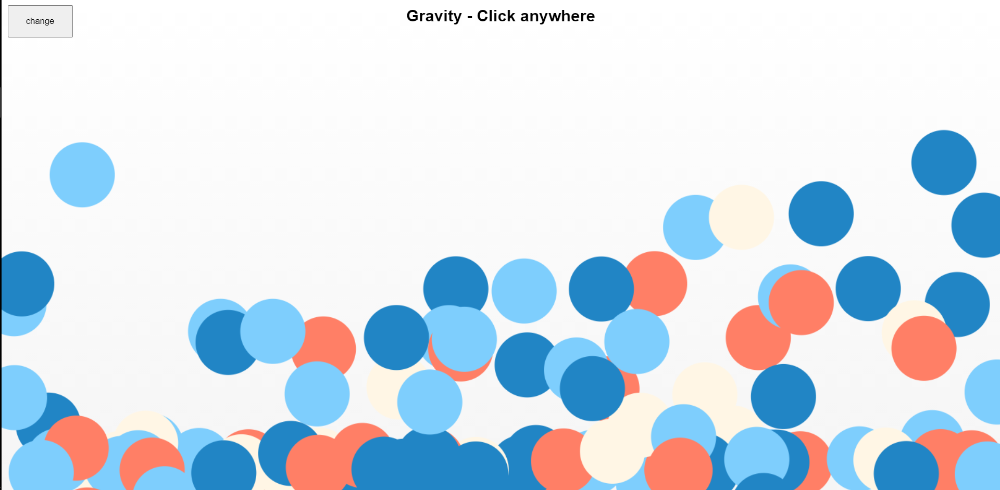

# HTML5 Canvas

- [This project](https://nikhilsourav.github.io/canvas/) aims to learn basic 2D drawing and short animations with HTML5 `<canvas>` element.

- The HTML5 `<canvas>` is an easy and powerful way to draw graphics and create animations using javascript.

- The `<canvas>` element itself is just a container for graphics.

- Scripting language like JavaScript is required to actually draw the graphics.

## Demo:

- Collision:

  

- Gravity:

  

- Spiral:

  

- Particles:

  

- Squares and Circles:

  

- Squares:

  
